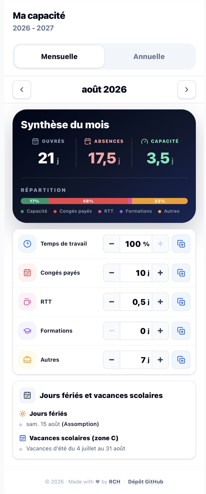
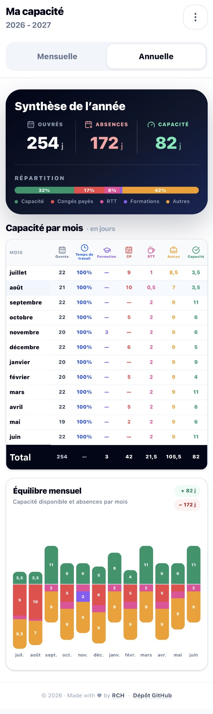

# Ma capacité

A small browser-only application for planning developer capacity over a July-to-June fiscal year.

[Open the application](https://kapa6t.pages.dev/) · [Contributing](CONTRIBUTING.md)

## Screenshots

<p align="center">
  
  
</p>

## Features

- Monthly and annual capacity views.
- Working time, paid leave, RTT, training and other absences.
- French public holidays and school zones A, B and C.
- Local-only persistence with CSV import and export.
- Responsive interface for desktop and mobile.

## Privacy

All application data stays in the browser `localStorage`. There is no account, backend or analytics service. CSV export is the portable backup mechanism.

Local storage is not encrypted, so the application must not be used to store secrets or sensitive personal information.

## Development

Requires Node.js `>=24 <25` and npm.

```bash
npm ci
npm run dev
```

Run all checks before submitting a change:

```bash
npm run check
```

Build and preview the production bundle with:

```bash
npm run build
npm run preview
```

See [CONTRIBUTING.md](CONTRIBUTING.md) for the project conventions, commit format and pull-request workflow.

## Deployment

Cloudflare Pages deploys `main` and creates previews for pull requests. The application is fully static and does not require a server-side runtime.

Browser security and cache headers are defined in `public/_headers`.

See [DEPLOYMENT.md](DEPLOYMENT.md) for the workflow and required secret names.

## License

Licensed under the [MIT License](LICENSE).
